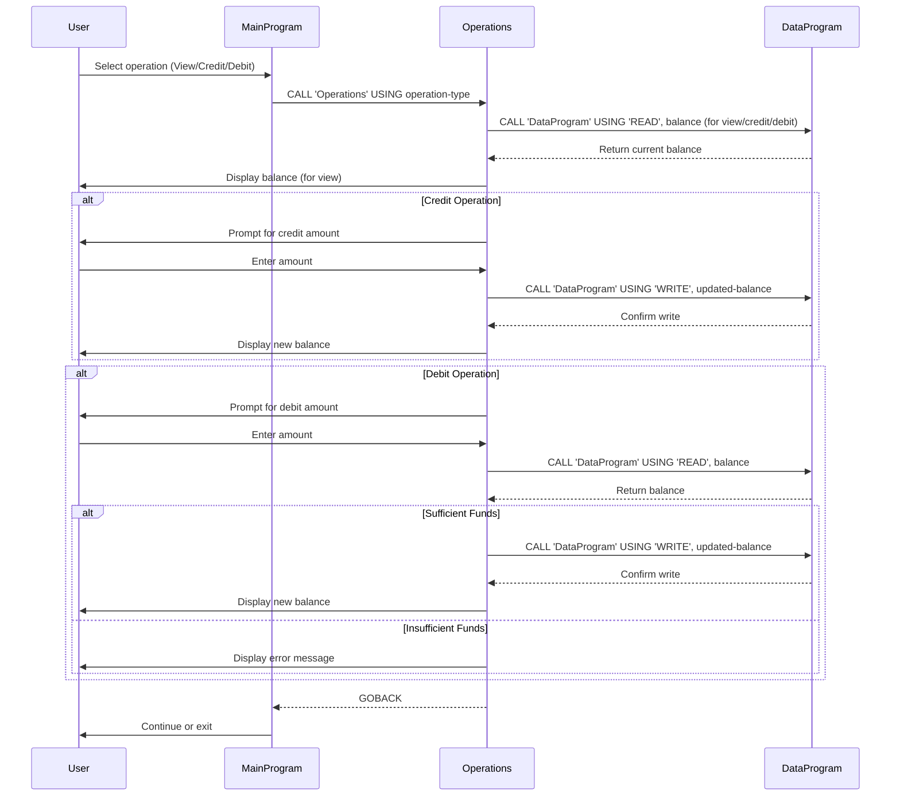

# COBOL School Accounting System Documentation

## Overview
This application is a simple school accounting system written in COBOL. It manages student account balances, allowing users to view balances, credit accounts, and debit accounts through a menu-driven interface.

## COBOL File Purposes

### 1. main.cob
- **Purpose:** Entry point and user interface for the application.
- **Key Functions:**
  - Displays a menu for account operations (View Balance, Credit, Debit, Exit).
  - Accepts user input and calls the `operations.cob` program with the selected operation type.
  - Loops until the user chooses to exit.
- **Business Rules:**
  - Only allows valid menu choices (1-4).

### 2. operations.cob
- **Purpose:** Handles the logic for each account operation.
- **Key Functions:**
  - Receives the operation type from `main.cob` (TOTAL, CREDIT, DEBIT).
  - For **View Balance**: Calls `data.cob` to read and display the current balance.
  - For **Credit**: Prompts for an amount, reads the current balance, adds the amount, writes the new balance, and displays it.
  - For **Debit**: Prompts for an amount, reads the current balance, checks for sufficient funds, subtracts the amount if possible, writes the new balance, and displays it. If funds are insufficient, displays an error.
- **Business Rules:**
  - Debits are only allowed if the account has sufficient funds.
  - All amounts are accepted as user input and validated for business logic.

### 3. data.cob
- **Purpose:** Manages persistent storage of the account balance.
- **Key Functions:**
  - Receives operation type (READ or WRITE) and a balance value.
  - For **READ**: Returns the current stored balance.
  - For **WRITE**: Updates the stored balance with the provided value.
- **Business Rules:**
  - The balance is initialized to 1000.00 by default.
  - Only READ and WRITE operations are supported.

## Business Rules Summary
- Only valid menu options are processed.
- Credits always increase the balance.
- Debits are only processed if the balance is sufficient; otherwise, an error is shown.
- The balance is persistent within the session and starts at 1000.00.

## Sequence Diagram: Data Flow

---
For more details, see the source code in `/src/cobol/`.
